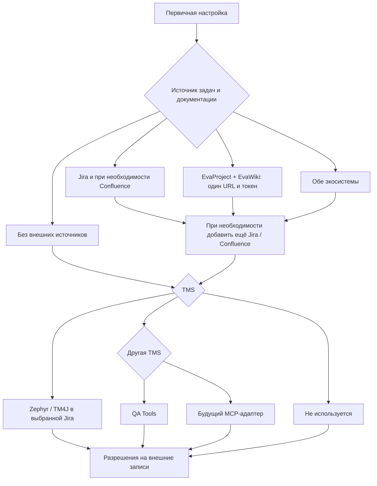

# Testdocs Kit

Переносимый набор правил, AI-скиллов и MCP-серверов для создания и поддержки тестовой документации.

Инструмент работает как intent-based QA-assistant: получает задачу, документ, ссылку, файл, свободное описание дефекта или тест-кейсы, сам выбирает workflow и возвращает только запрошенный артефакт. Он умеет формировать Jira-чек-листы и баг-репорты, полный пакет документации, отдельные и task-only кейсы, проводить review и оптимизировать существующий набор. Имена skills пользователю знать не нужно.

Поддерживаются:

- Codex в приложении ChatGPT, CLI и IDE;
- Claude Code;
- стабильный OpenCode и экспериментальный OpenCode V2;
- другие клиенты, которые поддерживают MCP и стандарт Agent Skills.

## Основные сценарии использования

Команды формулируются обычным языком. Достаточно указать требуемый результат и дать ссылку, ключ, документ или сами требования.

### 1. Чек-лист для задачи

```text
Подготовь чек-лист для тестирования: https://jira.example.test/browse/TASK-123
```

Результат: только готовый checklist в Jira Wiki Markup. Агент читает задачу и релевантные связанные материалы, но не запускает полный анализ постоянного TMS-покрытия.

### 2. Вся тестовая документация для задачи

```text
Подготовь всю тестовую документацию для TASK-123.
```

Результат: краткий scope, Jira checklist и необходимые новые или актуализированные Test Cases. Вывод содержит только полезные разделы, без внутренней маршрутизации и пустых отчётов.

### 3. Чек-лист или кейсы по документу

```text
Подготовь чек-лист по этому документу: https://confluence.example.test/pages/viewpage.action?pageId=12345
```

```text
Напиши тест-кейсы по приложенному документу.
```

```text
Сопоставь требования этого документа с существующими тест-кейсами и покажи пробелы покрытия.
```

Jira-задача необязательна. Источником может быть Confluence, PDF, DOCX, локальный файл или требования в сообщении.

### 4. Тест-кейсы для задачи

```text
Напиши тест-кейсы для TASK-123.
```

Результат: только кейсы в указанном scope. Агент не объявляет их частью регрессионной модели без отдельного запроса.

Если кейсы нужны только для текущего изменения:

```text
Напиши тест-кейсы только для проверки TASK-123. В регрессионную модель их не включать.
```

В таком режиме допускаются task-specific и разовые сценарии, поддержанные требованиями.

### 5. Только определённая часть задачи

```text
Для TASK-123 напиши тест-кейсы блока «Фильтры».
```

Агент не расширяет ответ до полного пакета и добавляет только обязательные зависимости запрошенного блока.

### 6. Оптимизация существующих кейсов

```text
Оптимизируй приложенные тест-кейсы и приведи их к текущим правилам. Убери дубли, но сохрани покрытие.
```

Результат: замечания, целевая структура и полные исправленные proposals. Изменения не записываются в TMS автоматически; дубли предлагаются к выводу из актуального покрытия, а не удаляются.

### 7. Ревью кейсов

```text
Проведи ревью PROJECT-T123 и PROJECT-T124.
```

Результат: статус, конкретные замечания и полная исправленная proposal-версия, когда изменения действительно нужны.

### 8. Актуализация и применение

```text
Актуализируй PROJECT-T123 с учётом следующего изменения: ...
```

Эта команда готовит diff и полную proposal-версию без записи. Для применения используется отдельная простая команда:

```text
Примени предложенные изменения в PROJECT-T123.
```

### Дополнительные действия

Свободное или надиктованное описание можно превратить в черновик:

```text
Составь баг-репорт: на странице оформления после удаления промокода итоговая сумма не пересчитывается...
```

Для записи нужен явный create-запрос и проект:

```text
Заведи этот баг в проекте SHOP. Назначь на меня, остальные необязательные routing-поля не угадывай.
```

Перед созданием агент читает живую схему полей проекта. Если Jira содержит отдельные поля для шагов, ожидаемого и фактического результата, используются они; иначе блоки попадают в структурированное `Описание`. Агент также добавляет подтверждённые ссылки на требования и макеты, точное окружение/URL и релевантные диагностические материалы. Для визуальных, поведенческих, backend и mobile-дефектов состав доказательств различается; секреты и персональные данные в запросах и логах маскируются.

```text
Опубликуй подготовленный checklist комментарием в TASK-123.
```

```text
Отправь checklist в QA Report и открой редактор в отдельной вкладке.
```

Если пользователь называет конкретный артефакт — чек-лист, тест-кейсы, coverage-анализ или баг-репорт — агент возвращает именно его. Только явное «Подготовь всю тестовую документацию для …» или «Подготовь полный пакет …» запускает checklist и Test Cases вместе. Неоднозначное «Подготовь тестирование …» не расширяется до всех артефактов молча. Формулировки «не для регресса» и название конкретного блока дополнительно ограничивают scope. Jira, Confluence и TMS необязательны: те же сценарии работают с текстом и файлами, переданными вручную. Подробнее — в [описании workflows](docs/workflows.md).

## Быстрая установка на macOS

Понадобятся:

- Git — на новом Mac при необходимости выполните `xcode-select --install`;
- хотя бы один поддерживаемый AI-клиент;
- адрес и учётные данные Jira и Confluence, если нужны интеграции;
- для Eva — единый адрес инстанса и созданный в Eva API-токен;
- для QA Tools — адрес инстанса и API-токен либо логин с паролем.

Для первого запуска используйте HTTPS — для него не требуется SSH-ключ GitHub:

```bash
git clone https://github.com/maldenbergsergey-png/testdocs-kit.git && cd testdocs-kit && bash setup-macos.sh
```

`setup-macos.sh` автоматически:

1. Проверяет Git, Node.js и npm.
2. Если Node.js/npm отсутствуют или версия Node.js ниже 20, предлагает установить Homebrew и Node.js.
3. После установки запускает обычный `npm run setup`.

Homebrew перед установкой показывает план изменений и может запросить пароль macOS. Его официальный установщик описан на [brew.sh](https://brew.sh/). Если Node.js уже установлен, bootstrap ничего не переустанавливает.

Проверить зависимости без запуска настройки:

```bash
bash setup-macos.sh --check
```

SSH используйте только после настройки ключа в GitHub:

```bash
git clone git@github.com:maldenbergsergey-png/testdocs-kit.git && cd testdocs-kit && bash setup-macos.sh
```

Важно использовать `&&`, а не три независимые команды. Тогда настройка не продолжится, если клонирование или переход в каталог завершились ошибкой.

## Ручная установка и другие системы

Для Linux и Windows установите [актуальную LTS-версию Node.js](https://nodejs.org/en/download) и Git, затем выполните:

```bash
git clone https://github.com/maldenbergsergey-png/testdocs-kit.git && cd testdocs-kit && npm run setup
```

Минимально поддерживается Node.js 20. Для новой установки рекомендуется актуальная LTS-версия.

### Ответить на вопросы установщика

Установщик попросит:

1. Выбрать Codex, Claude Code, OpenCode или все клиенты.
2. Выбрать основную систему: `Jira + Confluence`, `EvaProject + EvaWiki`, обе системы либо работу без интеграций.
3. Для каждой Jira выбрать Cloud, Server/Data Center с PAT, логин и пароль либо browser-session с SSO/2FA. После первой Jira можно добавить вторую, не перезаписывая первую.
4. Для Eva ввести один адрес всего инстанса и API-токен. Встроенный MCP предоставляет задачи EvaProject и документы EvaWiki через одно подключение.
5. Выбрать категорию TMS: `Zephyr Scale / Test Management for Jira`, `другая TMS` или `TMS не используется`.
6. Zephyr привязать к конкретной Jira. Отдельный адрес и токен для него не вводятся.
7. В категории `другая TMS` выбрать QA Tools либо сохранить placeholder другого MCP-провайдера для будущего адаптера.
8. Отдельно задать разрешения на создание багов и публикацию checklist для каждой Jira.
9. При необходимости подключить QA Report.



Пароли и токены вводятся скрыто. Они не записываются в репозиторий и не попадают в конфигурации AI-клиентов. При повторной настройке рядом с каждым вопросом показывается сохранённое значение: Enter оставляет его без изменений. Для скрытого секрета Enter также сохраняет прежний токен или пароль.

### Обновление без перенастройки

Если Testdocs Kit уже настроен, подтяните изменения и повторно примените сохранённый закрытый конфиг одной командой:

```bash
npm run update
```

Команда выполняет `git pull --ff-only`, обновляет зависимости, ссылки на скиллы и MCP-конфигурации клиентов. Вопросы о Jira, Eva, Confluence и TMS не задаются, сохранённые адреса и секреты не изменяются.

Чтобы одновременно разрешить создание Jira Bug и публикацию checklist-комментариев для всех сохранённых Jira-подключений без перенастройки адресов и учётных данных:

```bash
TESTDOCS_ENABLE_JIRA_WRITES=1 npm run update
```

Переменная работает и при первом обновлении со старой версии, чей updater ещё не знает нового флага. После установки этой версии эквивалентна команда `npm run update -- --enable-jira-writes`. Оба варианта включают только защищённые инструменты, которые дополнительно требуют явного запроса пользователя на конкретную запись. Произвольные комментарии, transitions и удаления остаются отключёнными.

Если изменения уже получены другим способом, примените существующие настройки без `git pull`:

```bash
npm run setup -- --reuse
```

### Полная и точечная перенастройка

Полностью пройти настройку заново, сохраняя старые значения как defaults:

```bash
npm run reconfigure
```

Перенастроить только выбранную часть:

```bash
npm run configure:jira
npm run configure:confluence
npm run configure:eva
npm run configure:tms
npm run configure:delivery
```

Добавить подключение, не меняя существующие:

```bash
npm run add:jira
npm run add:confluence
npm run add:eva
```

Если подключений одного типа несколько, точечная команда предложит выбрать их по локальному нейтральному ID. Секреты остальных подключений повторно вводить не потребуется.

### Перезапустить AI-клиент

После сообщения `Установка завершена` полностью перезапустите выбранный клиент.

В командах не требуется указывать абсолютный путь другого пользователя. Выполняйте их из каталога `testdocs-kit`. Флаг `--skip-dependencies` предназначен преимущественно для диагностики и тестов; обычное обновление должно проверить актуальные зависимости.

Проверьте подключение:

| Клиент | Проверка MCP | Проверка скиллов |
| --- | --- | --- |
| Codex | `/mcp` или `codex mcp list` | `/skills` или ввод `$` |
| Claude Code | `/mcp` или `claude mcp list` | ввести `/generate-test-cases` |
| OpenCode | `opencode mcp list` или `opencode2 mcp list` | ввести `/generate-test-cases` |
| Другой клиент | по инструкции клиента | проверить каталог Agent Skills |

## Что делает установщик

`npm run setup`:

1. Устанавливает зависимости Jira MCP, Confluence MCP, QA Tools proxy и встроенного Eva MCP.
2. Собирает TypeScript-сервер Confluence.
3. Подключает все каталоги QA-скиллов, включая intent-based workflow и генератор чек-листов.
4. Сохраняет любое количество Jira, Confluence и Eva-подключений, а также выбранную TMS в отдельном пользовательском файле версии 2. Старый одиночный конфиг автоматически мигрирует без потери значений.
5. Настраивает выбранные AI-клиенты.
6. Запускает локальную проверку MCP-handshake без чтения реальных Jira и Confluence данных.
7. Для Zephyr подключает создание и безопасное обновление кейсов только по явному запросу; update существующего case защищён повторным чтением и проверкой stale proposal.
8. Для QA Tools подключает официальный MCP инстанса через локальный proxy, который не раскрывает учётные данные клиенту, скрывает удаления и требует подтверждение изменяющих вызовов.
9. Для Eva запускает отдельное MCP-подключение на каждый инстанс и публикует только read-only tools задач, проектов, комментариев и документов. Изменяющие и удаляющие инструменты Eva отсутствуют.
10. По отдельному opt-in подключает создание одного Jira Bug после чтения живой схемы полей и явного запроса пользователя.
11. По отдельному opt-in подключает публикацию готового checklist в Jira и импорт в QA Report; произвольные комментарии и transitions остаются выключенными.
12. При необходимости подключает дополнительный доверенный CA-бандл, не отключая TLS-проверку.
13. Для каждого browser-session подключения Jira/Confluence использует отдельный session-файл, поэтому две Jira не перетирают cookies друг друга.

Секреты хранятся здесь:

- macOS и Linux: `~/.config/testdocs-kit/config.json`;
- Windows: `%APPDATA%\testdocs-kit\config.json`.

На macOS и Linux файлу назначаются права `600`.

Клиент получает только команду запуска `scripts/launch-mcp.mjs`. Launcher читает закрытый пользовательский конфиг и передаёт значения MCP-процессу. Поэтому токены не дублируются в `config.toml`, `opencode.json` или конфигурации Claude Code.

Для созданных и прочитанных кейсов Jira MCP возвращает полный адрес вида `https://jira.company.example/secure/Tests.jspa#/testCase/PROJECT-T123`. Если установка использует другой UI-маршрут, измените `connections.jira[].testCaseUrlTemplate` у нужного подключения в закрытом `~/.config/testdocs-kit/config.json`. Шаблон должен быть полным HTTP(S)-адресом и содержать `{key}`; дополнительно поддерживается `{projectKey}`. После изменения выполните `npm run setup -- --reuse` и перезапустите AI-клиент.

> После установки не удаляйте и не перемещайте каталог `testdocs-kit`: конфигурации MCP и ссылки на скиллы используют его абсолютный путь. Если каталог был перемещён, повторно выполните `npm run setup`.

## Поддерживаемые способы авторизации

### Jira

| Установка | Режим | Что вводить |
| --- | --- | --- |
| Jira Cloud | Basic Auth | email и API-токен Atlassian |
| Jira Server/Data Center с PAT | Bearer | персональный токен; логин не требуется |
| Старая Jira без токенов | Basic Auth | обычный логин и пароль |
| Jira с SSO или 2FA без доступа к Application Links | Browser session | интерактивный вход в отдельном окне браузера |

Для старой Jira установщик передаёт:

```text
JIRA_AUTH_MODE=basic
JIRA_EMAIL=<логин>
JIRA_TOKEN=<пароль>
JIRA_API_VERSION=2
```

Название `JIRA_EMAIL` историческое: в старой Jira это поле используется как обычный логин. Название `JIRA_TOKEN` также историческое: в режиме Basic Auth там может находиться пароль.

### EvaProject и EvaWiki

EvaProject и EvaWiki настраиваются как одно подключение с единым base URL. Для API используется токен, созданный в Eva. Логин и пароль пользователя в MCP-конфиг не передаются.

Дополнительно устанавливать Go, отдельный Eva MCP или настраивать `PATH` не требуется. Read-only Eva MCP входит в Testdocs Kit и устанавливается обычным `npm run setup` вместе с остальными локальными зависимостями. При подключении Eva тестировщик вводит только URL и API-токен.

Встроенный адаптер предоставляет чтение задач EvaProject, комментариев, проектов и документов EvaWiki. Create/update/delete/archive tools отсутствуют. Создание багов в Eva пока не поддерживается: для него нужен безопасный способ прочитать живую схему формы и пользовательских полей конкретного проекта.

### QA Tools (ТестОпс)

| Режим | Что вводить | Как подключается MCP |
| --- | --- | --- |
| API-токен | адрес инстанса и персональный API-токен | `Authorization: Api-Token …` к `<инстанс>/api/mcp` |
| Логин и пароль | адрес инстанса, локальный логин и пароль | локальный proxy получает короткоживущий Bearer-токен и подключает официальный MCP |

Режим API-токена рекомендован документацией QA Tools. Логин/пароль работает для локальной аутентификации, если инстанс разрешает OAuth password grant; при SSO или отключённом password grant используйте API-токен. Секреты хранятся только в закрытом конфиге Testdocs Kit. Read tools `testops_find_*`, `testops_get_*` и `testops_list_*` доступны после подключения. Остальные tools появляются только после отдельного разрешения, требуют явного подтверждения каждого изменения, а операции удаления proxy не публикует никогда.

Официальные справки: [подключение MCP-сервера QA Tools](https://docs.qatools.ru/ecosystem/mcp/setup/) и [список `testops_*` tools](https://docs.qatools.ru/ecosystem/mcp/tools/).

### Вход через браузер без участия администратора

Выберите вариант `4 — вход через браузер/SSO/2FA`. Установщик откроет отдельный профиль Google Chrome, Microsoft Edge или Chromium. Выполните обычный вход, включая корпоративный SSO и двухфакторное подтверждение. После успешной проверки Jira сессия сохранится вне репозитория.

Для Jira и Zephyr/TM4J используется одна сессия, поскольку TMS работает на том же адресе Jira. Confluence на другом адресе получает отдельную сессию.

Проверить или восстановить сессию вручную:

```bash
npm run auth -- jira
npm run auth -- confluence
```

Если Jira или Confluence несколько, добавьте ID подключения из закрытого конфига или вывода setup:

```bash
npm run auth -- jira jira-2
npm run auth -- confluence confluence-2
```

Если сохранённая сессия ещё действует, команда завершится без открытия браузера. Принудительно выполнить вход повторно:

```bash
npm run auth -- jira jira-2 --force
```

При подтверждённом истечении MCP возвращает `AUTH_REQUIRED` с командой восстановления. Обычный `403` с действующей сессией считается нехваткой прав и не вызывает повторный вход.

Browser-session режим:

- не требует API-токена, OAuth Application Link или помощи администратора;
- требует установленный Chrome, Edge или Chromium;
- не копирует cookies из личного профиля браузера, а использует отдельный профиль Testdocs Kit;
- сохраняет session-файлы в `~/.config/testdocs-kit/sessions/` с правами `600` на macOS и Linux;
- никогда не выводит значения cookies в чат, MCP-ответы или логи;
- повторяет вход только при отсутствующей/истёкшей сессии либо с флагом `--force`.

Если браузер установлен нестандартно, укажите его полный путь:

```bash
TESTDOCS_BROWSER="/полный/путь/к/браузеру" npm run auth -- jira
```

### Confluence

| Установка | Режим | Что вводить |
| --- | --- | --- |
| Confluence Cloud | Basic Auth | email и API-токен Atlassian |
| Confluence Server/Data Center с PAT | Bearer | персональный токен |
| Старый Confluence без токенов | Basic Auth | обычный логин и пароль |
| Confluence с SSO или 2FA | Browser session | интерактивный вход в отдельном окне браузера |

## Особенности установки по клиентам

### Codex

Скиллы подключаются через `~/.agents/skills`. MCP-серверы добавляются в управляемый блок файла `~/.codex/config.toml`.

Перед изменением существующей конфигурации создаётся резервная копия. Повторный запуск установщика заменяет только блок Testdocs Kit и не дублирует его.

Официальные справки: [Skills в Codex](https://developers.openai.com/codex/skills/) и [MCP в Codex](https://developers.openai.com/codex/mcp/).

### Claude Code

Скиллы подключаются через `~/.claude/skills`. MCP регистрируется в user scope с помощью `claude mcp add`, поэтому доступен во всех проектах пользователя.

Если команда `claude` не найдена, установщик не меняет конфигурацию вручную. Готовые команды сохраняются в:

```text
~/.config/testdocs-kit/client-snippets/claude-code.txt
```

Их можно выполнить после установки Claude Code.

Официальные справки: [Skills в Claude Code](https://code.claude.com/docs/en/slash-commands) и [MCP в Claude Code](https://code.claude.com/docs/en/mcp).

### OpenCode

Скиллы устанавливаются в совместимый каталог `~/.agents/skills`.

Установщик изменяет глобальный `~/.config/opencode/opencode.json`:

- для стабильного `opencode` добавляет серверы непосредственно в `mcp`;
- для экспериментального `opencode2` добавляет серверы в `mcp.servers`;
- автоматически определяет установленный клиент и исправляет конфиг, созданный версией Testdocs Kit 0.2.0;
- перед изменением создаёт резервную копию;
- проверяет итоговый конфиг командой клиента.

Write-инструменты не требуют отдельного запрета в OpenCode: они не регистрируются самим Jira MCP, пока в закрытом конфиге Testdocs Kit явно не разрешена запись. Установщик всегда оставляет её выключенной.

Если существующий файл содержит JSONC-комментарии или нестандартный JSON, установщик не перезаписывает его. Готовый безопасный фрагмент сохраняется в `client-snippets/opencode-stable.json` или `client-snippets/opencode-v2.json`.

Официальные справки: [Skills](https://opencode.ai/docs/skills/) и [MCP](https://opencode.ai/docs/mcp-servers/) стабильного OpenCode, а также [Skills](https://opencode.ai/v2/docs/skills) и [MCP](https://opencode.ai/v2/docs/mcp-servers) OpenCode V2.

### Другие MCP-клиенты

Для клиента, который не поддерживается напрямую, выберите `generic`. Установщик создаст:

```text
~/.config/testdocs-kit/client-snippets/generic-mcp.json
```

В файле находятся STDIO-конфигурации выбранных подключений: Jira, Confluence, Eva, QA Tools и QA Report добавляются только когда включены. Скопируйте нужные записи в MCP-настройки своего клиента.

Скиллы размещаются в `~/.agents/skills`. Если клиент использует другой каталог, укажите ему этот путь либо скопируйте каталоги из `testdocs-kit/skills` в поддерживаемое место.

Поддержка MCP не означает автоматическую поддержку Agent Skills. Для неизвестного клиента формат и каталог скиллов нужно сверить с его документацией.

## Проверка после установки

Проверка конфигурации и MCP-handshake без чтения рабочих задач и страниц:

```bash
npm run check
```

Состав строк зависит от числа подключений. Например:

```text
Jira jira-main: 15 инструментов
Confluence confluence-main: 5 read-only инструментов
Eva eva-main: read-only инструменты
Проверка установки: OK
```

При разрешённом создании багов Jira показывает на один инструмент больше. Разрешённая публикация checklist добавляет ещё один. При включённом QA Report дополнительно выводится `QA Report: 1 инструмент импорта по явному запросу`.

В обычном режиме проверка запускает настроенные MCP и проверяет их handshake; содержимое рабочих задач и страниц не запрашивается. В тестовом `--no-cli` режиме для Eva проверяется встроенный адаптер без запроса к API, а для внешнего QA Tools пропускается удалённый handshake. Действительность Eva-токена подтверждается при первом запросе чтения.

При выбранном Zephyr доступны защищённые Zephyr tools и, только после отдельных opt-in, `jira_create_bug`, `jira_publish_checklist_comment` и `qa_report_import_checklist`. Existing-case update требует fingerprint полного baseline и отклоняет stale proposal. При выбранном QA Tools proxy получает актуальные `testops_*` tools от инстанса, скрывает изменяющие операции без opt-in и всегда скрывает удаления.

### Проверка Jira

Возьмите известную задачу, которую вашей учётной записи разрешено читать:

```text
Прочитай Jira-задачу TASK-123.
Покажи ключ, название, описание и критерии приёмки.
Ничего не изменяй и не добавляй комментарии.
```

Чтобы только получить кейсы в чате:

```text
Сформируй тест-кейсы по задаче TASK-123. Ничего не создавай во внешних системах.
```

Чтобы явно разрешить создание новых кейсов:

```text
Сформируй и создай новые тест-кейсы по задаче TASK-123 в проекте PROJECT, в существующей папке /Regression. Существующие кейсы не изменяй.
```

Без слов `создай` или `опубликуй` скилл показывает результат только в чате. Для создания должны быть указаны проект и существующая папка; неизвестную папку инструмент не придумывает и не создаёт. После успешной записи ответ содержит кликабельный ключ и полный адрес каждого созданного кейса.

Чтобы исправить кейс, созданный только что этим же подключением:

```text
В созданном только что кейсе PROJECT-T124 убери второй пункт из шага 3 и раздели перечисление полей на строки. Примени исправление в Zephyr. Другие кейсы не изменяй.
```

После перезапуска OpenCode, другого AI-клиента или самого MCP право на исправление сбрасывается. Кейс из предыдущей сессии можно только прочитать и подготовить предложение по изменению.

### Проверка Confluence

Возьмите ID известной страницы из её URL:

```text
Прочитай страницу Confluence с ID 123456.
Верни название и содержимое в Markdown.
Ничего не изменяй.
```

### Создание тест-кейсов по Jira-задаче

Codex:

```text
Используй $collect-test-context для TASK-123, затем $generate-test-cases.

Сформируй минимальный достаточный набор регрессионных тест-кейсов.
Кейсы должны быть понятны тестировщику, который не знаком с проектом.
Учти каждое поле и ограничение из источника: покрой его, явно исключи с причиной или вынеси в неоднозначности.
Найди релевантные ссылки на требования и макеты в Jira и связанных страницах Confluence. Добавь их в «Цель» с понятным описанием назначения каждой ссылки.
Несколько полей или значений в одной ячейке показывай вертикальным списком.
Если шагу не нужны тестовые данные, оставь ячейку пустой.
Покажи результат в чате. Ничего не публикуй.
```

Claude Code или OpenCode:

```text
Используй /collect-test-context для TASK-123, затем /generate-test-cases.

Сформируй минимальный достаточный набор регрессионных тест-кейсов.
Учти каждое поле и ограничение из источника.
Учти релевантные ссылки на требования и макеты и подпиши назначение каждой ссылки в «Цель».
Несколько полей или значений в одной ячейке показывай вертикальным списком.
Если шагу не нужны тестовые данные, оставь ячейку пустой.
Покажи результат в чате. Ничего не публикуй.
```

Без Jira можно вставить требование прямо в чат:

```text
Используй скилл generate-test-cases.

Требование:
Авторизованный пользователь может изменить имя в профиле.
Имя обязательно, допускает от 2 до 50 символов. Если поле пустое,
отображается ошибка «Введите имя».

Сформируй минимальный набор регрессионных тест-кейсов.
```

## Обновление

Чтобы получить новую версию без повторного ввода настроек:

```bash
cd testdocs-kit
npm run update
npm run check
```

`npm run update` выполняет fast-forward pull и повторно применяет сохранённый закрытый конфиг без вопросов. Если обновление уже скачано, используйте `npm run setup -- --reuse`. Для осознанной полной перенастройки выполните `npm run reconfigure`; Enter оставляет прежнее значение любого вопроса, включая скрытый токен или пароль.

Чтобы при обновлении без вопросов включить защищённое создание Jira Bug и публикацию checklist, выполните `TESTDOCS_ENABLE_JIRA_WRITES=1 npm run update`. После установки этой версии также доступен флаг `npm run update -- --enable-jira-writes`.

Ссылки на скиллы обновятся автоматически. Зависимости MCP будут переустановлены по lock-файлам, а конфигурации клиентов — безопасно обновлены. После успешной проверки полностью перезапустите AI-клиент.

Основные команды для проверки bug-report workflow:

```text
Составь баг-репорт по следующему описанию, но ничего не создавай: ...
```

```text
Заведи этот баг в проекте DEMO. Используй поля и правила только этого Jira-проекта.
```

```text
Найди связанные требования и макеты только в материалах DEMO-123 и добавь прямые ссылки в баг-репорт.
```

## Дополнительные параметры установщика

Настроить только Codex:

```bash
npm run setup -- --clients codex
```

Codex и OpenCode:

```bash
npm run setup -- --clients codex,opencode
```

Обычно формат OpenCode определяется автоматически. Для явного выбора:

```bash
npm run setup -- --clients opencode --opencode-format stable
npm run setup -- --clients opencode --opencode-format v2
```

Подключить дополнительный CA-бандл для Jira и Confluence:

```bash
npm run setup -- --ca-file /absolute/path/to/ca-bundle.pem
```

Файл должен содержать один или несколько PEM-сертификатов. В закрытом пользовательском конфиге сохраняется только его абсолютный путь.

Не переустанавливать зависимости:

```bash
npm run setup -- --skip-dependencies
```

Если в каталоге скиллов уже есть другой скилл с таким же именем, установщик не перезаписывает его. Чтобы сначала переименовать существующий каталог в резервную копию:

```bash
npm run setup -- --force
```

Показать все параметры:

```bash
npm run setup -- --help
```

## Доступные скиллы

| Скилл | Назначение |
| --- | --- |
| [`prepare-task-testing`](skills/prepare-task-testing/SKILL.md) | Главный intent-based workflow: checklist, полный пакет, cases-only, task-only, targeted scope или optimization/review. |
| [`create-bug-report`](skills/create-bug-report/SKILL.md) | Превратить свободное или голосовое описание в баг-репорт и по явному запросу создать Bug с учетом полей конкретного Jira-проекта. |
| [`generate-test-checklist`](skills/generate-test-checklist/SKILL.md) | Сформировать checklist по задаче, документу или требованиям в Jira Wiki Markup. |
| [`collect-test-context`](skills/collect-test-context/SKILL.md) | Собрать контекст из Jira, Confluence, TMS, чата или файлов. |
| [`generate-test-cases`](skills/generate-test-cases/SKILL.md) | Создать новые тест-кейсы. |
| [`analyze-test-coverage`](skills/analyze-test-coverage/SKILL.md) | Определить пробелы и необходимость создания или обновления кейсов. |
| [`update-test-cases`](skills/update-test-cases/SKILL.md) | Показать diff и полную proposal-версию; по явному запросу безопасно применить актуальное предложение. |
| [`review-test-cases`](skills/review-test-cases/SKILL.md) | Проверить качество и сразу показать исправленную proposal-версию при замечаниях. |
| [`build-coverage-matrix`](skills/build-coverage-matrix/SKILL.md) | Построить матрицу тестового покрытия. |
| [`build-regression-model`](skills/build-regression-model/SKILL.md) | Собрать переиспользуемую регрессионную модель. |
| [`derive-test-case-standard`](skills/derive-test-case-standard/SKILL.md) | Вывести общие правила из тестовой документации и инструкций. |

## Безопасность

- Секреты хранятся только в пользовательском `config.json` вне репозитория.
- `.env`, локальные конфигурации, зависимости и логи исключены из Git.
- `zephyr_create_test_case` доступен для прямого явного запроса пользователя создать новые кейсы. Просьба только сформировать или показать кейсы ничего не публикует.
- `zephyr_update_session_test_case` доступен только для явного исправления ключа, который тот же MCP-процесс создал в своей текущей сессии. Реестр ключей хранится только в памяти и очищается при перезапуске.
- `zephyr_update_test_case` обновляет ранее существующий case только после явного apply-запроса, полного baseline read и повторной проверки его content fingerprint непосредственно перед PUT. При конфликте запись отклоняется.
- `jira_get_bug_create_metadata` доступен только для чтения схемы формы и текущего пользователя. `jira_create_bug` регистрируется только после отдельного opt-in и принимает вызов лишь с явным create-намерением; комментарии, вложения, связи, transitions и последующие правки в операцию не входят.
- `jira_publish_checklist_comment` регистрируется только после отдельного opt-in в setup и требует явного запроса на публикацию каждого конкретного checklist. Generic `add_comment` и `transition_issue` остаются выключенными.
- `qa_report_import_checklist` регистрируется только после настройки QA Report и отдельного opt-in. Разметка передаётся в POST body, а не через URL; открывается только URL, возвращённый QA Report.
- Установщик всегда записывает `enableWrites: false`; версии, переносы, произвольные комментарии, смена статуса, links и другие общие write-операции не регистрируются.
- Перед созданием должны быть известны целевой инстанс, проект, существующая папка или корень и полное содержимое кейса.
- Автоматическое удаление внешних тест-кейсов запрещено.
- Не включайте `JIRA_INSECURE_TLS=1` или `CONFLUENCE_INSECURE_TLS=1`. Передайте доверенный PEM-бандл через `--ca-file` или исправьте цепочку сертификатов на сервере.
- Если токен попал в пример, лог, чат или историю Git, отзовите его и выпустите новый.

## Ограничения текущего MCP

- Для одного кейса `zephyr_get_test_case` сначала использует совместимый endpoint `/rest/atm/1.0/testcase/{key}`, который возвращает полный текущий кейс и `testScript.steps`. Шаги сортируются по полю `index`.
- Если полный endpoint недоступен, MCP использует `/rest/tests/1.0/testcase/search` как запасной вариант и явно помечает ответ `_testdocs.complete: false`. Такой ответ содержит только метаданные и не считается подтверждением содержания шагов.
- Поиск по `projectKey` использует совместимый `/rest/atm/1.0/testcase/search`; при поиске по числовому `projectId` MCP может сам переключиться на него внутри одного вызова. Известный ключ нужно читать напрямую через `zephyr_get_test_case`, без предварительного поиска и выгрузки всего проекта.
- Массовый поиск Zephyr через `/rest/tests/1.0` ограничен первыми 1000 кейсами проекта.
- Пока нет универсальной операции получения всех кейсов, связанных с конкретной Jira-задачей.
- Создание реализовано через `POST /rest/atm/1.0/testcase`, обновление — через `PUT /rest/atm/1.0/testcase/{key}`. При изменении шагов передаётся полный итоговый список: отсутствующие шаги удаляются, а шаги без ID создаются заново. На конкретной старой установке операции нужно проверить демонстрационным кейсом.
- Guarded update не создаёт новую версию, не меняет status/folder/links и зависит от возможности полного direct read. Metadata-only fallback недостаточен для записи.
- Jira Server/Data Center получает checklist как Jira Wiki Markup. Для Jira Cloud строгая checklist-разметка преобразуется в ADF headings/tables перед публикацией.
- Для Jira Server/Data Center схема создания бага читается через expanded create metadata. Для Jira Cloud MCP сначала получает типы задач проекта, затем поля выбранного defect type через актуальные project/issue-type create-metadata endpoints.
- QA Report import требует доступного Node.js backend и endpoint `/api/checklists/import`. Возвращённая ссылка временная; Testdocs Kit не встраивает редактор и не конструирует URL самостоятельно.
- OpenCode сам решает, показывать ли карточки вызовов MCP и оболочки. Testdocs Kit сокращает лишние вызовы и не переносит восстановленные промежуточные ошибки в итоговый ответ, но не может скрыть элементы интерфейса клиента. Если конечная операция действительно завершилась ошибкой, она остаётся видимой.
- Преобразование сложной Confluence-разметки в Markdown может быть неполным.

Эти ограничения не мешают проверять генерацию по Jira и Confluence, но должны учитываться при анализе существующего покрытия.

## Если что-то не работает

### `npm run setup` не запускается

Проверьте:

```bash
node --version
npm --version
```

Требуется Node.js 20 или новее.

Если Windows PowerShell блокирует `npm.ps1` из-за политики выполнения сценариев,
запустите тот же npm launcher напрямую:

```powershell
npm.cmd run setup
```

Если настройки уже были сохранены предыдущей попыткой, используйте
`npm.cmd run setup -- --reuse`, чтобы не вводить их повторно.

### OpenCode сообщает `Unrecognized key: permissions`

Эту ошибку создавала версия Testdocs Kit 0.2.0 при установке в стабильный OpenCode. Обновите репозиторий и повторите настройку:

```bash
git pull
npm run setup -- --clients opencode
```

Установщик удалит только добавленное им несовместимое поле, перенесёт свои MCP-серверы в правильный раздел и проверит конфиг через `opencode debug config`.

### MCP не отображается

1. Выполните `npm run check`.
2. Полностью перезапустите AI-клиент.
3. Проверьте MCP-командой из таблицы выше.
4. Если репозиторий перемещался, повторите `npm run setup`.

### Ошибка `401`

Неправильный логин, пароль, токен или режим авторизации. Повторно выполните `npm run setup` и выберите правильный тип установки.

### Ошибка `403`

Подключение прошло, но у пользователя недостаточно прав на задачу, страницу, проект или тестовую библиотеку.

### Jira работает, а Zephyr возвращает `404`

Для чтения одного кейса MCP автоматически пробует полный `/rest/atm/1.0` и запасной `/rest/tests/1.0`. Если оба варианта недоступны, уточните у администратора название и версию приложения, права пользователя и доступность этих API-префиксов.

### Ошибка сертификата

Ошибки `UNABLE_TO_VERIFY_LEAF_SIGNATURE`, `SELF_SIGNED_CERT_IN_CHAIN` и `UNABLE_TO_GET_ISSUER_CERT` означают, что Node.js не может построить доверенную TLS-цепочку.

Предпочтительное решение — настроить сервер так, чтобы он отдавал полную цепочку сертификатов. Для корпоративного или отсутствующего промежуточного CA можно безопасно передать PEM-бандл:

```bash
npm run setup -- --answers "$HOME/.config/testdocs-kit/config.json" --skip-dependencies --ca-file /absolute/path/to/ca-bundle.pem
```

В каталоге [`certificates/`](certificates/) находится проверенный публичный промежуточный сертификат GlobalSign, который нужен серверам с сертификатом `GlobalSign GCC R3 DV TLS CA 2020`, но не отправляющим intermediate:

```bash
npm run setup -- --answers "$HOME/.config/testdocs-kit/config.json" --skip-dependencies --ca-file "$PWD/certificates/globalsign-gcc-r3-dv-tls-ca-2020.pem"
```

TLS-проверка при этом остаётся включённой.

## Структура репозитория

```text
testdocs-kit/
├── README.md
├── AGENTS.md
├── package.json
├── certificates/       # дополнительные публичные CA-сертификаты
├── scripts/            # установка, launcher и проверка
├── rules/              # источник правил тестовой документации
├── skills/             # переносимые Agent Skills
├── examples/           # короткие универсальные примеры
├── integrations/       # контракты Jira, Confluence и TMS
└── mcp/
    ├── jira-mcp/
    ├── confluence-mcp/
    └── qa-tools-mcp/
```

Папка `rules/` является источником истины. Скиллы используют общие правила и не должны создавать собственную противоречащую политику.

## Основные принципы тест-кейсов

- Тестировщик, не знакомый с проектом, должен понимать, куда зайти и что сделать.
- Все поля Zephyr выводятся на русском языке и в едином порядке: `Название`, `Цель`, `Предусловия`, `Путь`, шаги, `Постусловия`, `Теги`, `Статус`, `Приоритет`.
- Отдельного раздела `Тестовые данные` нет. Шаги оформляются напрямую как Markdown-таблица `№ | Шаг | Тестовые данные | Ожидаемый результат`, без общего кодового блока.
- Если шаг не использует тестовые данные, его ячейка остаётся пустой; текст `Не требуются` туда не добавляется.
- Релевантные ссылки на требования, документацию и макеты добавляются в поле `Цель` под блоком `Материалы` как именованные кликабельные ссылки; Zephyr-адаптер преобразует Markdown-ссылку в rich-text ссылку.
- Кейс не перегружается внутренней технической реализацией.
- Неизвестные требования, данные и поведение нельзя придумывать.
- Одинаковый блок на нескольких страницах покрывается одним базовым функциональным кейсом; кейсы направлений содержат только отличия и вызывают базовый кейс первым шагом.
- Админское покрытие пользовательской сущности оформляется по одному связанному кейсу на создание, обновление и удаление; только перегруженная операция делится на нумерованные этапы. Каждый такой кейс получает тег `админка`, а кейс создания/настройки вызывается первым шагом функционального кейса, если подходящая сущность ещё не настроена.
- Мелкие связанные элементы объединяются в кейс блока; крупный блок делится только на логические функциональные части.
- Постоянные web UI кейсы ориентируются на основной desktop breakpoint и не дублируются по разрешениям.
- Каждое создание или изменение кейса сопровождается отдельным кратким комментарием о сути и причине; комментарий не помещается в `Цель`.
- Служебный анализ, обоснование приоритета и заметки о покрытии не добавляются в тело кейса без отдельного запроса.
- Ранее существующий case изменяется только после отдельного явного apply-запроса и успешной stale-proposal проверки; review и proposal остаются read-only.
- Регрессионный кейс должен оставаться понятным после завершения конкретной задачи разработки.

Эталонный формат закреплён в [`rules/test-case-standard.md`](rules/test-case-standard.md). Проверить примеры локально:

```bash
npm run test:format
```
