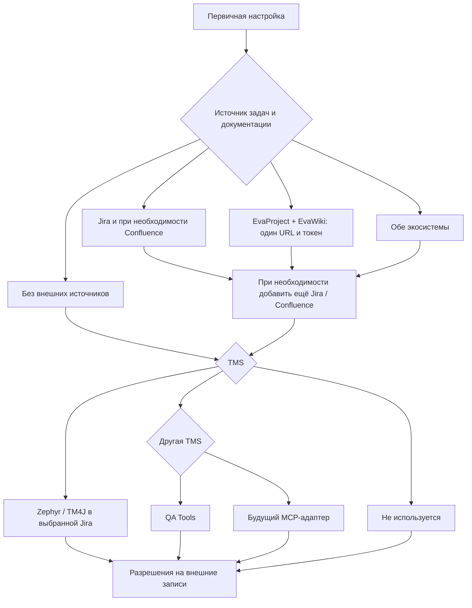

# Установка, обновление и подключения

## Быстрая установка на macOS

Понадобятся:

- Git — на новом Mac при необходимости выполните `xcode-select --install`;
- хотя бы один поддерживаемый AI-клиент;
- адрес и учётные данные Jira и Confluence, если нужны интеграции;
- для Eva — единый адрес инстанса и созданный в Eva API-токен;
- для QA Tools — адрес инстанса и API-токен либо логин с паролем.

Для первого запуска используйте HTTPS — для него не требуется SSH-ключ GitHub:

```bash
git clone https://github.com/maldenbergsergey-png/testdocs-kit.git && cd testdocs-kit && bash setup-macos.sh
```

`setup-macos.sh` автоматически:

1. Проверяет Git, Node.js и npm.
2. Если Node.js/npm отсутствуют или версия Node.js ниже 20, предлагает установить Homebrew и Node.js.
3. После установки запускает обычный `npm run setup`.

Homebrew перед установкой показывает план изменений и может запросить пароль macOS. Его официальный установщик описан на [brew.sh](https://brew.sh/). Если Node.js уже установлен, bootstrap ничего не переустанавливает.

Проверить зависимости без запуска настройки:

```bash
bash setup-macos.sh --check
```

SSH используйте только после настройки ключа в GitHub:

```bash
git clone git@github.com:maldenbergsergey-png/testdocs-kit.git && cd testdocs-kit && bash setup-macos.sh
```

Важно использовать `&&`, а не три независимые команды. Тогда настройка не продолжится, если клонирование или переход в каталог завершились ошибкой.

## Ручная установка и другие системы

Для Linux и Windows установите [актуальную LTS-версию Node.js](https://nodejs.org/en/download) и Git, затем выполните:

```bash
git clone https://github.com/maldenbergsergey-png/testdocs-kit.git && cd testdocs-kit && npm run setup
```

Минимально поддерживается Node.js 20. Для новой установки рекомендуется актуальная LTS-версия.

### Ответить на вопросы установщика

Установщик попросит:

1. Выбрать Codex, Claude Code, OpenCode или все клиенты.
2. Выбрать основную систему: `Jira + Confluence`, `EvaProject + EvaWiki`, обе системы либо работу без интеграций.
3. Для каждой Jira выбрать Cloud, Server/Data Center с PAT, логин и пароль либо browser-session с SSO/2FA. После первой Jira можно добавить вторую, не перезаписывая первую.
4. Для Eva ввести один адрес всего инстанса и API-токен. Встроенный MCP предоставляет задачи EvaProject и документы EvaWiki через одно подключение.
5. Выбрать категорию TMS: `Zephyr Scale / Test Management for Jira`, `другая TMS` или `TMS не используется`.
6. Zephyr привязать к конкретной Jira. Отдельный адрес и токен для него не вводятся.
7. В категории `другая TMS` выбрать QA Tools либо сохранить placeholder другого MCP-провайдера для будущего адаптера.
8. Отдельно задать разрешения на создание багов и публикацию checklist для каждой Jira.
9. При необходимости подключить QA Report.
10. При необходимости подключить официальные remote MCP: Figma, GitLab и Postman; для поддерживаемого Elastic Agent Builder — Kibana/Elastic endpoint.

Figma Remote, GitLab и Postman US используют браузерный OAuth; Figma Desktop использует вход в приложении Figma без OAuth клиента. В GitLab корпоративный Keycloak остаётся частью штатного GitLab OAuth flow. Postman EU и Elastic API key задаются через переменные окружения, имя которых сохраняется в конфигурации, а значение ключа — нет. Повторно изменить только эти подключения можно командой:

```bash
npm run configure:integrations
```



Пароли и токены вводятся скрыто. Они не записываются в репозиторий и не попадают в конфигурации AI-клиентов. OAuth-токены официальных remote MCP хранит сам клиент вне репозитория. При повторной настройке рядом с каждым вопросом показывается сохранённое значение: Enter оставляет его без изменений. Для скрытого секрета Enter также сохраняет прежний токен или пароль.

### Обновление без перенастройки

Если Testdocs Kit уже настроен, подтяните изменения и повторно примените сохранённый закрытый конфиг одной командой:

```bash
npm run update
```

Команда выполняет `git pull --ff-only`, обновляет зависимости, ссылки на скиллы и MCP-конфигурации клиентов. Вопросы о Jira, Eva, Confluence, TMS и remote MCP не задаются, сохранённые адреса, пользовательская история и секреты не изменяются.

### Локальная история тестирования

Рабочая папка создаётся только когда для задачи нужно сохранить отчёты, доказательства или продолжить проверку позднее:

```bash
npm run workspace -- init --project DEMO --task DEMO-123
```

По умолчанию данные находятся в пользовательском data directory (`~/.local/share/testdocs-kit` на macOS/Linux), вне репозитория. Структура разделяет проекты и задачи; обновление набора её не затрагивает. Агент обращается только к workspace задачи, нужной для текущего запроса.

Чтобы одновременно разрешить создание Jira Bug, публикацию checklist-комментариев, создание Zephyr Test Run и связанной QA-задачи для всех сохранённых Jira-подключений без перенастройки адресов и учётных данных:

```bash
TESTDOCS_ENABLE_JIRA_WRITES=1 npm run update
```

Переменная работает и при первом обновлении со старой версии, чей updater ещё не знает нового флага. После установки этой версии эквивалентна команда `npm run update -- --enable-jira-writes`. Оба варианта включают только защищённые инструменты, которые дополнительно требуют явного запроса пользователя на конкретную запись. Произвольные комментарии, transitions и удаления остаются отключёнными.

Чтобы включить только создание Test Run и связанной QA-задачи для единственной Jira, выбранной текущим Zephyr-провайдером, не включая Bug/checklist и другие Jira-подключения:

```bash
npm run update -- --enable-release-test-run-writes
```

Если изменения уже получены другим способом, примените существующие настройки без `git pull`:

```bash
npm run setup -- --reuse
```

### Полная и точечная перенастройка

Полностью пройти настройку заново, сохраняя старые значения как defaults:

```bash
npm run reconfigure
```

Перенастроить только выбранную часть:

```bash
npm run configure:jira
npm run configure:confluence
npm run configure:eva
npm run configure:tms
npm run configure:delivery
```

Добавить подключение, не меняя существующие:

```bash
npm run add:jira
npm run add:confluence
npm run add:eva
```

Если подключений одного типа несколько, точечная команда предложит выбрать их по локальному нейтральному ID. Секреты остальных подключений повторно вводить не потребуется.

### Перезапустить AI-клиент

После сообщения `Установка завершена` полностью перезапустите выбранный клиент.

В командах не требуется указывать абсолютный путь другого пользователя. Выполняйте их из каталога `testdocs-kit`. Флаг `--skip-dependencies` предназначен преимущественно для диагностики и тестов; обычное обновление должно проверить актуальные зависимости.

Проверьте подключение:

| Клиент | Проверка MCP | Проверка скиллов |
| --- | --- | --- |
| Codex | `/mcp` или `codex mcp list` | `/skills` или ввод `$` |
| Claude Code | `/mcp` или `claude mcp list` | ввести `/generate-test-cases` |
| OpenCode | `opencode mcp list` или `opencode2 mcp list` | ввести `/generate-test-cases` |
| Другой клиент | по инструкции клиента | проверить каталог Agent Skills |

## Что делает установщик

`npm run setup`:

1. Устанавливает зависимости Jira MCP, Confluence MCP, QA Tools proxy и встроенного Eva MCP.
2. Собирает TypeScript-сервер Confluence.
3. Подключает все каталоги QA-скиллов, включая intent-based workflow и генератор чек-листов.
4. Сохраняет любое количество Jira, Confluence и Eva-подключений, а также выбранную TMS в отдельном пользовательском файле версии 2. Старый одиночный конфиг автоматически мигрирует без потери значений.
5. Настраивает выбранные AI-клиенты.
6. Запускает локальную проверку MCP-handshake без чтения реальных Jira и Confluence данных.
7. Для Zephyr после `--enable-test-case-writes` подключает создание и исправление кейсов текущей MCP-сессии. Каждая операция требует явного запроса; для остальных кейсов доступны только предложения.
8. Для QA Tools подключает официальный MCP инстанса через локальный proxy, который не раскрывает учётные данные клиенту, скрывает удаления и требует подтверждение изменяющих вызовов.
9. Для Eva запускает отдельное MCP-подключение на каждый инстанс и публикует только read-only tools задач, проектов, комментариев и документов. Изменяющие и удаляющие инструменты Eva отсутствуют.
10. По отдельному opt-in подключает создание одного Jira Bug после чтения живой схемы полей и явного запроса пользователя.
11. По отдельному opt-in подключает публикацию готового checklist в Jira и импорт в QA Report; произвольные комментарии и transitions остаются выключенными.
12. При необходимости подключает дополнительный доверенный CA-бандл, не отключая TLS-проверку.
13. Для каждого browser-session подключения Jira/Confluence использует отдельный session-файл, поэтому две Jira не перетирают cookies друг друга.

Секреты хранятся здесь:

- macOS и Linux: `~/.config/testdocs-kit/config.json`;
- Windows: `%APPDATA%\testdocs-kit\config.json`.

На macOS и Linux файлу назначаются права `600`.

Клиент получает только команду запуска `scripts/launch-mcp.mjs`. Launcher читает закрытый пользовательский конфиг и передаёт значения MCP-процессу. Поэтому токены не дублируются в `config.toml`, `opencode.json` или конфигурации Claude Code.

Для созданных и прочитанных кейсов Jira MCP возвращает полный адрес вида `https://jira.company.example/secure/Tests.jspa#/testCase/PROJECT-T123`. Если установка использует другой UI-маршрут, измените `connections.jira[].testCaseUrlTemplate` у нужного подключения в закрытом `~/.config/testdocs-kit/config.json`. Шаблон должен быть полным HTTP(S)-адресом и содержать `{key}`; дополнительно поддерживается `{projectKey}`. После изменения выполните `npm run setup -- --reuse` и перезапустите AI-клиент.

> После установки не удаляйте и не перемещайте каталог `testdocs-kit`: конфигурации MCP и ссылки на скиллы используют его абсолютный путь. Если каталог был перемещён, повторно выполните `npm run setup`.

## Поддерживаемые способы авторизации

### Jira

| Установка | Режим | Что вводить |
| --- | --- | --- |
| Jira Cloud | Basic Auth | email и API-токен Atlassian |
| Jira Server/Data Center с PAT | Bearer | персональный токен; логин не требуется |
| Старая Jira без токенов | Basic Auth | обычный логин и пароль |
| Jira с SSO или 2FA без доступа к Application Links | Browser session | интерактивный вход в отдельном окне браузера |

Для старой Jira установщик передаёт:

```text
JIRA_AUTH_MODE=basic
JIRA_EMAIL=<логин>
JIRA_TOKEN=<пароль>
JIRA_API_VERSION=2
```

Название `JIRA_EMAIL` историческое: в старой Jira это поле используется как обычный логин. Название `JIRA_TOKEN` также историческое: в режиме Basic Auth там может находиться пароль.

### EvaProject и EvaWiki

EvaProject и EvaWiki настраиваются как одно подключение с единым base URL. Для API используется токен, созданный в Eva. Логин и пароль пользователя в MCP-конфиг не передаются.

Дополнительно устанавливать Go, отдельный Eva MCP или настраивать `PATH` не требуется. Read-only Eva MCP входит в Testdocs Kit и устанавливается обычным `npm run setup` вместе с остальными локальными зависимостями. При подключении Eva тестировщик вводит только URL и API-токен.

Встроенный адаптер предоставляет чтение задач EvaProject, комментариев, проектов и документов EvaWiki. Create/update/delete/archive tools отсутствуют. Скилл `create-bug-report` поддерживает создание багов в Eva через живую форму в отдельно подключённом браузере: тестировщик явно выбирает, относится ли баг к фиче или должен попасть в бэклог. Для фичи нужна родительская задача; для бэклога - целевой проект, создание доступно через его форму или хедер. Скилл проверяет живую структуру, создаёт задачу типа "Ошибка" в выбранной ветке, назначает её на текущего тестировщика и указывает его постановщиком. Шаги и результаты оформляются заголовками в описании, когда отдельных полей нет; материалы загружаются через форму. Для этого пути нужны доступная браузерная сессия Eva и разрешения клиента. Один API-токен Eva не даёт возможности записи. Подробности и ограничения - в [профиле Eva](../integrations/profiles/eva.md#browser-creation-workflow).

### QA Tools (ТестОпс)

| Режим | Что вводить | Как подключается MCP |
| --- | --- | --- |
| API-токен | адрес инстанса и персональный API-токен | `Authorization: Api-Token …` к `<инстанс>/api/mcp` |
| Логин и пароль | адрес инстанса, локальный логин и пароль | локальный proxy получает короткоживущий Bearer-токен и подключает официальный MCP |

Режим API-токена рекомендован документацией QA Tools. Логин/пароль работает для локальной аутентификации, если инстанс разрешает OAuth password grant; при SSO или отключённом password grant используйте API-токен. Секреты хранятся только в закрытом конфиге Testdocs Kit. Read tools `testops_find_*`, `testops_get_*` и `testops_list_*` доступны после подключения. Остальные tools появляются только после отдельного разрешения, требуют явного подтверждения каждого изменения, а операции удаления proxy не публикует никогда.

Официальные справки: [подключение MCP-сервера QA Tools](https://docs.qatools.ru/ecosystem/mcp/setup/) и [список `testops_*` tools](https://docs.qatools.ru/ecosystem/mcp/tools/).

### Вход через браузер без участия администратора

Выберите вариант `4 — вход через браузер/SSO/2FA`. Установщик откроет отдельный профиль Google Chrome, Microsoft Edge или Chromium. Выполните обычный вход, включая корпоративный SSO и двухфакторное подтверждение. После успешной проверки Jira сессия сохранится вне репозитория.

Для Jira и Zephyr/TM4J используется одна сессия, поскольку TMS работает на том же адресе Jira. Confluence на другом адресе получает отдельную сессию.

Проверить или восстановить сессию вручную:

```bash
npm run auth -- jira
npm run auth -- confluence
```

Если Jira или Confluence несколько, добавьте ID подключения из закрытого конфига или вывода setup:

```bash
npm run auth -- jira jira-2
npm run auth -- confluence confluence-2
```

Если сохранённая сессия ещё действует, команда завершится без открытия браузера. Принудительно выполнить вход повторно:

```bash
npm run auth -- jira jira-2 --force
```

При подтверждённом истечении MCP возвращает `AUTH_REQUIRED` с командой восстановления. Обычный `403` с действующей сессией считается нехваткой прав и не вызывает повторный вход.

Browser-session режим:

- не требует API-токена, OAuth Application Link или помощи администратора;
- требует установленный Chrome, Edge или Chromium;
- не копирует cookies из личного профиля браузера, а использует отдельный профиль Testdocs Kit;
- сохраняет session-файлы в `~/.config/testdocs-kit/sessions/` с правами `600` на macOS и Linux;
- никогда не выводит значения cookies в чат, MCP-ответы или логи;
- повторяет вход только при отсутствующей/истёкшей сессии либо с флагом `--force`.

Если браузер установлен нестандартно, укажите его полный путь:

```bash
TESTDOCS_BROWSER="/полный/путь/к/браузеру" npm run auth -- jira
```

### Confluence

| Установка | Режим | Что вводить |
| --- | --- | --- |
| Confluence Cloud | Basic Auth | email и API-токен Atlassian |
| Confluence Server/Data Center с PAT | Bearer | персональный токен |
| Старый Confluence без токенов | Basic Auth | обычный логин и пароль |
| Confluence с SSO или 2FA | Browser session | интерактивный вход в отдельном окне браузера |

## Особенности установки по клиентам

### Codex

Скиллы подключаются через `~/.agents/skills`. MCP-серверы добавляются в управляемый блок файла `~/.codex/config.toml`.

Перед изменением существующей конфигурации создаётся резервная копия. Повторный запуск установщика заменяет только блок Testdocs Kit и не дублирует его.

Официальные справки: [Skills в Codex](https://developers.openai.com/codex/skills/) и [MCP в Codex](https://developers.openai.com/codex/mcp/).

### Claude Code

Скиллы подключаются через `~/.claude/skills`. MCP регистрируется в user scope с помощью `claude mcp add`, поэтому доступен во всех проектах пользователя.

Если команда `claude` не найдена, установщик не меняет конфигурацию вручную. Готовые команды сохраняются в:

```text
~/.config/testdocs-kit/client-snippets/claude-code.txt
```

Их можно выполнить после установки Claude Code.

Официальные справки: [Skills в Claude Code](https://code.claude.com/docs/en/slash-commands) и [MCP в Claude Code](https://code.claude.com/docs/en/mcp).

### OpenCode

Скиллы устанавливаются в совместимый каталог `~/.agents/skills`.

Установщик изменяет глобальный `~/.config/opencode/opencode.json`:

- для стабильного `opencode` добавляет серверы непосредственно в `mcp`;
- для экспериментального `opencode2` добавляет серверы в `mcp.servers`;
- автоматически определяет установленный клиент и исправляет конфиг, созданный версией Testdocs Kit 0.2.0;
- перед изменением создаёт резервную копию;
- проверяет итоговый конфиг командой клиента.

Write-инструменты не требуют отдельного запрета в OpenCode: они не регистрируются самим Jira MCP, пока в закрытом конфиге Testdocs Kit явно не разрешена запись. Установщик всегда оставляет её выключенной.

Если существующий файл содержит JSONC-комментарии или нестандартный JSON, установщик не перезаписывает его. Готовый безопасный фрагмент сохраняется в `client-snippets/opencode-stable.json` или `client-snippets/opencode-v2.json`.

Официальные справки: [Skills](https://opencode.ai/docs/skills/) и [MCP](https://opencode.ai/docs/mcp-servers/) стабильного OpenCode, а также [Skills](https://opencode.ai/v2/docs/skills) и [MCP](https://opencode.ai/v2/docs/mcp-servers) OpenCode V2.

### Другие MCP-клиенты

Для клиента, который не поддерживается напрямую, выберите `generic`. Установщик создаст:

```text
~/.config/testdocs-kit/client-snippets/generic-mcp.json
```

В файле находятся STDIO-конфигурации выбранных подключений: Jira, Confluence, Eva, QA Tools и QA Report добавляются только когда включены. Скопируйте нужные записи в MCP-настройки своего клиента.

Скиллы размещаются в `~/.agents/skills`. Если клиент поддерживает другой каталог, настройте в нём обнаружение этого пути или ссылки на скиллы в полном checkout. Копирование отдельных исходных каталогов `skills/` теряет общие правила; используйте экспорт установщика, описанный ниже.

Поддержка MCP не означает автоматическую поддержку Agent Skills. Для неизвестного клиента формат и каталог скиллов нужно сверить с его документацией.

## Проверка после установки

Проверка конфигурации и MCP-handshake без чтения рабочих задач и страниц:

```bash
npm run check
```

Проверка выводит подключённые сервисы и фактический набор инструментов. Их количество зависит от выбранного TMS, числа подключений и отдельных разрешений записи; фиксированное число не является критерием исправной установки.

В обычном режиме проверка запускает настроенные MCP и проверяет их handshake; содержимое рабочих задач и страниц не запрашивается. В тестовом `--no-cli` режиме для Eva проверяется встроенный адаптер без запроса к API, а для внешнего QA Tools пропускается удалённый handshake. Действительность Eva-токена подтверждается при первом запросе чтения.

При выбранном Zephyr доступны read-tools для кейсов, их связей с Jira-задачами, чтения Test Run с фактически сохранёнными назначениями через `zephyr_get_test_run` и поиска существующих папок через `zephyr_list_test_run_folders`, case tools после `--enable-test-case-writes` и, только после отдельных opt-in, `jira_create_bug`, `jira_publish_checklist_comment`, `zephyr_create_test_run`, `zephyr_assign_test_run_item`, `jira_create_qa_work_item` и `qa_report_import_checklist`. Создание Test Run теперь перечитывает прогон, проверяет каждое назначение и при необходимости один раз применяет публичное `assignedTo` для конкретного исполнения; неподтверждённые назначения не считаются успешными. Отдельный защищённый tool позволяет по явному запросу исправить одно назначение в существующем прогоне с чтением до и после записи. Поиск папок опирается на существующие Test Run: публичный Server/DC API не отдаёт дерево пустых папок. Для создания Test Run в корне поле `folder` не передаётся; значение `/` не используется. Изменение ранее существовавших кейсов временно запрещено; доступна только коррекция кейсов, созданных текущим MCP-процессом. При выбранном QA Tools proxy получает актуальные `testops_*` tools от инстанса, без opt-in даёт только чтение; после opt-in добавляет только `testops_create_testcase`. Другие записи временно скрыты, поскольку у proxy нет реестра созданных в сессии кейсов.

### Проверка Jira

Возьмите известную задачу, которую вашей учётной записи разрешено читать:

```text
Прочитай Jira-задачу TASK-123.
Покажи ключ, название, описание и критерии приёмки.
Ничего не изменяй и не добавляй комментарии.
```

Чтобы только получить кейсы в чате:

```text
Сформируй тест-кейсы по задаче TASK-123. Ничего не создавай во внешних системах.
```

Чтобы явно разрешить создание новых кейсов:

```text
Сформируй и создай новые тест-кейсы по задаче TASK-123 в проекте PROJECT, в существующей папке /Regression. Существующие кейсы не изменяй.
```

Без слов `создай` или `опубликуй` скилл показывает результат только в чате. Для создания должны быть указаны проект и существующая папка; неизвестную папку инструмент не придумывает и не создаёт. После успешной записи ответ содержит кликабельный ключ и полный адрес каждого созданного кейса.

Чтобы исправить кейс, созданный только что этим же подключением:

```text
В созданном только что кейсе PROJECT-T124 убери второй пункт из шага 3 и раздели перечисление полей на строки. Примени исправление в Zephyr. Другие кейсы не изменяй.
```

После перезапуска OpenCode, другого AI-клиента или самого MCP право на исправление сбрасывается. Кейс из предыдущей сессии можно только прочитать и подготовить предложение по изменению.

### Проверка Confluence

Возьмите ID известной страницы из её URL:

```text
Прочитай страницу Confluence с ID 123456.
Верни название и содержимое в Markdown.
Ничего не изменяй.
```

### Создание тест-кейсов по Jira-задаче

Codex:

```text
Используй $collect-test-context для TASK-123, затем $generate-test-cases.

Сформируй минимальный достаточный набор регрессионных тест-кейсов.
Кейсы должны быть понятны тестировщику, который не знаком с проектом.
Учти каждое поле и ограничение из источника: покрой его, явно исключи с причиной или вынеси в неоднозначности.
Найди релевантные ссылки на требования и макеты в Jira и связанных страницах Confluence. Добавь их в «Цель» с понятным описанием назначения каждой ссылки.
Несколько полей или значений в одной ячейке показывай вертикальным списком.
Если шагу не нужны тестовые данные, оставь ячейку пустой.
Покажи результат в чате. Ничего не публикуй.
```

Claude Code или OpenCode:

```text
Используй /collect-test-context для TASK-123, затем /generate-test-cases.

Сформируй минимальный достаточный набор регрессионных тест-кейсов.
Учти каждое поле и ограничение из источника.
Учти релевантные ссылки на требования и макеты и подпиши назначение каждой ссылки в «Цель».
Несколько полей или значений в одной ячейке показывай вертикальным списком.
Если шагу не нужны тестовые данные, оставь ячейку пустой.
Покажи результат в чате. Ничего не публикуй.
```

Без Jira можно вставить требование прямо в чат:

```text
Используй скилл generate-test-cases.

Требование:
Авторизованный пользователь может изменить имя в профиле.
Имя обязательно, допускает от 2 до 50 символов. Если поле пустое,
отображается ошибка «Введите имя».

Сформируй минимальный набор регрессионных тест-кейсов.
```

## Обновление

Чтобы получить новую версию без повторного ввода настроек:

```bash
cd testdocs-kit
npm run update
npm run check
```

`npm run update` выполняет fast-forward pull и повторно применяет сохранённый закрытый конфиг без вопросов. Если обновление уже скачано, используйте `npm run setup -- --reuse`. Для осознанной полной перенастройки выполните `npm run reconfigure`; Enter оставляет прежнее значение любого вопроса, включая скрытый токен или пароль.

Чтобы при обновлении без вопросов включить защищённое создание Jira Bug, публикацию checklist, Test Run и связанной QA-задачи, выполните `TESTDOCS_ENABLE_JIRA_WRITES=1 npm run update`. После установки этой версии также доступен флаг `npm run update -- --enable-jira-writes`.

Для узкого включения только Test Run и связанной QA-задачи в выбранной Zephyr Jira используйте `npm run update -- --enable-release-test-run-writes`.

Ссылки на скиллы обновятся автоматически. Зависимости MCP будут переустановлены по lock-файлам, а конфигурации клиентов — безопасно обновлены. После успешной проверки полностью перезапустите AI-клиент.

Основные команды для проверки bug-report workflow:

```text
Составь баг-репорт по следующему описанию, но ничего не создавай: ...
```

```text
Заведи этот баг в проекте DEMO. Используй поля и правила только этого Jira-проекта.
```

```text
Найди связанные требования и макеты только в материалах DEMO-123 и добавь прямые ссылки в баг-репорт.
```

## Дополнительные параметры установщика

Настроить только Codex:

```bash
npm run setup -- --clients codex
```

Codex и OpenCode:

```bash
npm run setup -- --clients codex,opencode
```

Обычно формат OpenCode определяется автоматически. Для явного выбора:

```bash
npm run setup -- --clients opencode --opencode-format stable
npm run setup -- --clients opencode --opencode-format v2
```

Подключить дополнительный CA-бандл для Jira и Confluence:

```bash
npm run setup -- --ca-file /absolute/path/to/ca-bundle.pem
```

Файл должен содержать один или несколько PEM-сертификатов. В закрытом пользовательском конфиге сохраняется только его абсолютный путь.

Не переустанавливать зависимости:

```bash
npm run setup -- --skip-dependencies
```

Если в каталоге скиллов уже есть другой скилл с таким же именем, установщик не перезаписывает его. Чтобы сначала переименовать существующий каталог в резервную копию:

```bash
npm run setup -- --force
```

Показать все параметры:

```bash
npm run setup -- --help
```


## Копирование скиллов и права записи

Обычно установщик создаёт ссылки на checkout. Если ссылки недоступны, он экспортирует скиллы с абсолютными ссылками на полный снимок ресурсов в пользовательском каталоге конфигурации `testdocs-kit/skill-pack/resources/`. Снимок находится вне каталога обнаружения скиллов. Скопированные Markdown-файлы не зависят от расположения исходного checkout.

Повторная установка и `npm run update` обновляют неизменённые копии, помеченные установщиком. Чужие, старые непомеченные и вручную изменённые каталоги сохраняются с предупреждением. Для их замены используйте `npm run setup -- --reuse --force`: резервная копия сохраняется вне каталога скиллов, в `skill-pack/backups/`. Данные прогонов не затрагиваются. Снимки ресурсов и резервные копии не удаляются автоматически.

На новой установке создание кейсов и коррекция текущей сессии выключены. Чтобы явно включить их без перенастройки подключений:

```bash
npm run setup -- --reuse --enable-test-case-writes
```

Или при обновлении: `npm run update -- --enable-test-case-writes`. Ранее явно сохранённое значение `enableTestCaseCreation` сохраняется; обновление больше не включает его принудительно. Опция не разрешает обновлять кейсы, созданные вне текущего MCP-процесса. Любая запись дополнительно требует явного запроса пользователя на конкретную операцию.
